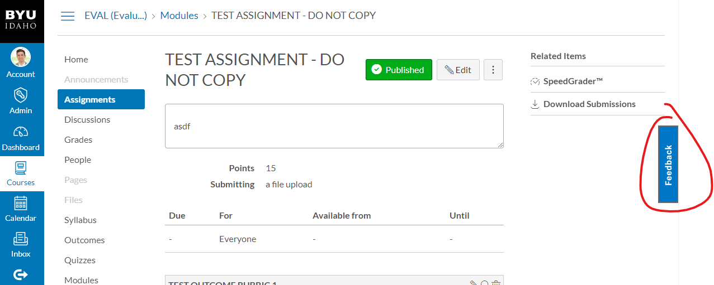
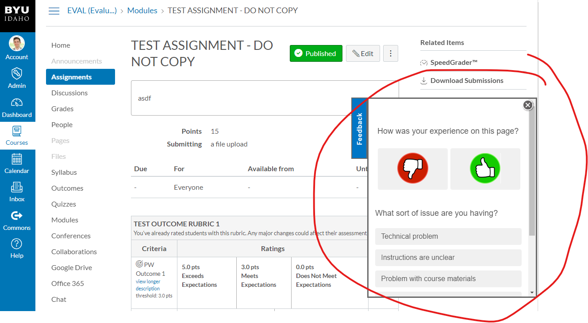

# Project Capture Document for (Title of Project) 
#### *Author: Levi Stum* 
#### *Stakeholder(s): Steve Stokes* 
#### *Date: May 8, 2019*

## Background

Brother Stokes has a 30-day demo to experiment with a qualtrics tool which allows us to add a feedback button.
This would be used in Canvas so if the students ever are having issues with a page they can give feedback specifying whether it's Canvas, the content, the quiz, etc.
This survey will also have embedded data so we will know exactlly where the issue is so we can address it.

-----

## Definition of Done

A working feedback tool that gives us the data of the user and web page they're on. Successfully implementing this in the Canvas JS (at least in the test environment) to see how it works.

-----

# Requirements

### General Requirements

### Input Requirements

#### Definition of Inputs

User Input into the survey in the popup.

<!-- List here a type definition for each input. For example, if it is a CSV define the column names. If it is a JSON, give an example of the JSON structure. If it is user input, what will the user be asked for? -->

#### Source of Inputs

Qualtrics survey/popup that is injected via JavaScript.

<!-- Paragraph of how to get inputs. From who? From where: Slack, email, server...? This also includes user selected options at runtime. How will we know what options to select? For example, in conversion tool, you'd follow the values on the Trello Board. It would also include the steps to get access to the information you need, such as getting added to a Trello Board, or access to a server. -->

---

### Output Requirements

#### Definition of Outputs

Successful Popup
Grabs embedded data from user:
  - Username
  - Course
  - URL
  - Item Type (quiz, assignment, etc.)
  - Semester (Spring, Fall, etc.)
  - Location (city, state, etc.)

<!-- List here a type definition for each output? For example, if the changes are directly to the LMS, list all changes that occur. If it is a CSV define the column names. If it is a JSON, give an example of the JSON structure. -->

#### Destination of Outputs

After the survey gets that data it will send it to qualtrics for stakeholders and others to be able to organize and find the source of the problem.

<!-- Paragraph where/who to send outputs. To who? To where: Email, server, directly to LMS...? It would also include the steps to get access to the locations you need, such as getting added to a Trello Board, or access to a server, or the LMS. -->

---

### User Interface

#### Type:

It will be a feedback UI tool on Canvas. It will pop up on the right side of the screen.

-----

## Expectations

### Timeline

- Create Feedback Popup (this week)
- Populate popup with proper survey (this week)
- Get embedded data (from the user) (next week)
- Implement in test environment of Canvas JS (end of next week)
- Determine usefulness/future actions at that point

### Best Mode of Contact
Email - stokesst@byui.edu
Or his office - Lamprecht 108

### Next Meeting

### Action Items
Get popup working in Canvas and then see if we can't pass data to Qualtrics through it
<!-- Recap Meeting -->
#### TechOps
#### Stakeholder

-----

#### *Approved By:*
#### *Approval Date:*
